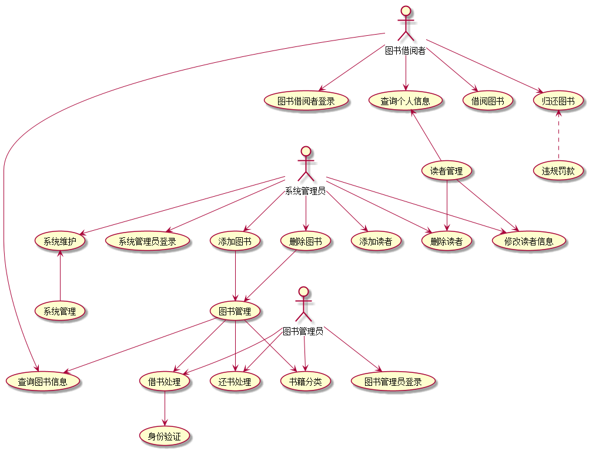

# 实验2：图书管理系统用例建模

## 1. 图书管理系统的用例关系图

### 1.1 用例图PlantUML源码如下：

``` 
@startuml
:系统管理员:-->(系统管理员登录)
:系统管理员: -->(添加图书)
:系统管理员: -->(删除图书)
:系统管理员: -->(添加读者)
:系统管理员: -->(删除读者)
:系统管理员: -->(修改读者信息)
:系统管理员: -->(系统维护)
:系统维护: <--(系统管理)
:添加图书: -->(图书管理)
:删除图书: -->(图书管理)
:图书借阅者: -->(图书借阅者登录)
:图书借阅者: -->(查询个人信息)
:查询个人信息: <--(读者管理)
:读者管理: -->(删除读者)
:读者管理: -->(修改读者信息)
:图书借阅者: -->(查询图书信息)
:图书借阅者: -->(借阅图书)
:图书借阅者: -->(归还图书)
:图书管理员: --> (图书管理员登录)
:图书管理员:-->(借书处理)
:图书管理员:-->(还书处理)
:图书管理员:-->(书籍分类)
:借书处理:-->(身份验证)
:归还图书:<..(违规罚款)
:图书管理: -->(借书处理)
:图书管理: -->(还书处理)
:图书管理: -->(书籍分类)
:图书管理: -->(查询图书信息)
@enduml
```


### 1.2. 用例图如下：


## 2. 参与者说明：

###     2.1 图书管理员

主要职责是：图书管理

###     2.2 读者

主要职责是：用户管理

###     2.3 系统管理员
    
主要职责是：账号管理

##     3. 用例规约表

###     3.1 “图书管理”用例
|用例名称|管理|
|:------|:---------|
|参与者|图书管理员|
|前置条件 |图书管理员已被识别和授权|
|后置条件 |更新图书信息|
|主事件流|1.系统发给图书管理员待处理信息<br> 2.图书管理员处理信息，并将处理的信息返回给系统；<br> 3.系统记录并修改信息|


###     3.2 “用户管理”用例
|用例名称|用户管理|
|:------|:---------|
|参与者|图书借阅者|
|前置条件 |图书借阅者已被识别和授权|
|后置条件 |更新个人信息|
|主事件流|1.系统发给图书借阅者个人信息（包括借阅状态）<br> 2.借阅者可以向系统发出借书或者还书请求<br> 3.系统接收处理并存储信息返还给借阅者并更新图书信息;<br>|
###     3.3 “系统管理”用例
|用例名称|用户管理|
|:------|:---------|
|参与者|系统管理员|
|前置条件 |系统管理员已被识别和授权|
|后置条件 |更新账号信息|
|主事件流|1.系统将所有图书信息和借阅者账号信息发给管理员<br> 2.管理员可以将信息修改并返还给系统<br> 3.系统接收处理并存储信息;<br>|

**“图书管理”用例：**
https://github.com/zwdbox/is_analysis

**“用户管理”用例**

**“系统管理”用例**

