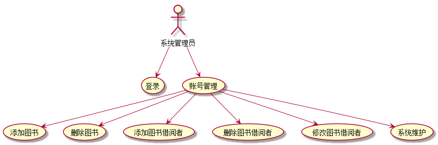
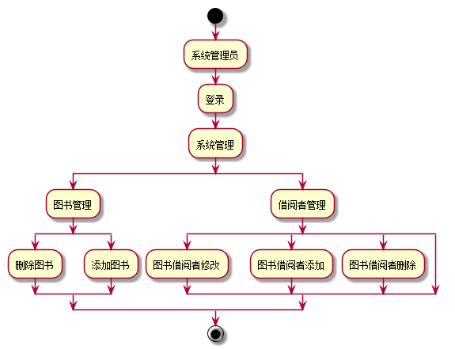

# 实验2：图书管理系统用例建模
## 1.系统管理用例
### 1.1系统管理用例PlantUML源码如下：
```
@startuml
:系统管理员:-->(登录)
:系统管理员:-->(账号管理)
:账号管理: -->(添加图书)
:账号管理: -->(删除图书)
:账号管理: -->(添加图书借阅者)
:账号管理: -->(删除图书借阅者)
:账号管理: -->(修改图书借阅者)
:账号管理: -->(系统维护)
@enduml
```
### 1.2系统管理用例图如下：




**“系统管理”用例流程图源码如下：**
``` 
@startuml
start
:系统管理员;
:登录;
:系统管理;
split
:图书管理;
split
:删除图书;
split again
:添加图书;
end split
split again
:借阅者管理;
split
:图书借阅者修改;
split again
:图书借阅者添加;
split again
:图书借阅者删除;
split again
end split
end split
stop
@enduml
```

**“系统管理”用例流程图如下：**


##    2.用例规约表

### “添加/删除信息”用例
|用例名称|添加/删除/修改信息|
|:------|:---------|
|参与者|系统管理员|
|前置条件 |系统管理员已被识别和授权|
|后置条件 |更新图书信息，更新用户信息|
|主事件流|1.系统发给系统管理员图书信息，和用户信息<br> 2.系统管理员对信息进行修改删除添加处理，并将处理的信息返回给系统；<br> 3.系统记录并修改信息|


