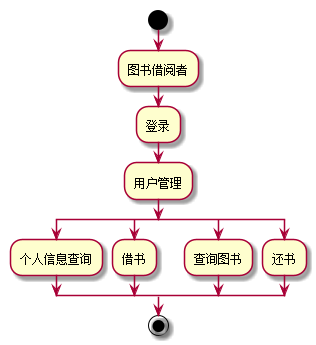

# 实验2：图书管理系统用例建模
## 1.借阅者管理用例
### 1.1借阅者管理用例PlantUML源码如下：
```
@startuml
:图书借阅者: -->(图书借阅者登录)
:图书借阅者: -->(用户管理)
:用户管理: -->(查询个人信息)
:用户管理: -->(查询图书)
:用户管理: -->(借阅图书)
:用户管理: -->(归还图书)
@enduml
```
### 1.2借阅者管理用例图如下：


**“借阅者管理”用例流程图源码如下：**
``` 
@startuml
start
:图书借阅者;
:登录;
:用户管理;
split
:个人信息查询;
split again
:借书;
split again
:查询图书;
split again
:还书;
end split
stop
@enduml
```

**“借阅者管理”用例流程图如下：**



