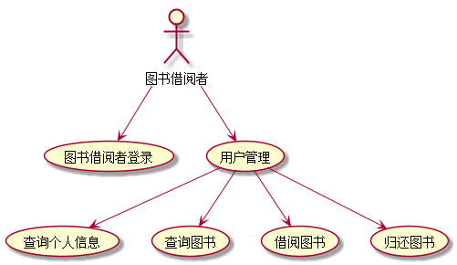

# 实验2：图书管理系统用例建模
## 1.借阅者管理用例
### 1.1借阅者管理用例PlantUML源码如下：
```
@startuml
:图书借阅者: -->(图书借阅者登录)
:图书借阅者: -->(用户管理)
:用户管理: -->(查询个人信息)
:用户管理: -->(查询图书)
:用户管理: -->(借阅图书)
:用户管理: -->(归还图书)
@enduml
```
### 1.2借阅者管理用例图如下：




**“借阅者管理”用例流程图源码如下：**
``` 
@startuml
start
:图书借阅者;
:登录;
:用户管理;
split
:个人信息查询;
split again
:借书;
split again
:查询图书;
split again
:还书;
end split
stop
@enduml
```

**“借阅者管理”用例流程图如下：**


### 借还书规约
|用例名称|借阅者借还书|
|:------|:---------|
|参与者|图书借阅者|
|前置条件 |图书借阅者已被识别和授权|
|后置条件 |更新图书状态，存储借书请求|
|主事件流|1.系统发给图书借阅者图书信息（库存，简介）和借阅者借阅图书信息（借阅图书状态）<br> 2.图书借阅者借阅（归还）图书，并将处理的信息返回给系统；<br> 3.系统判断还书是否违规，借书是否符合要求<br>4.系统存储处理结果，并更新图书状态|

