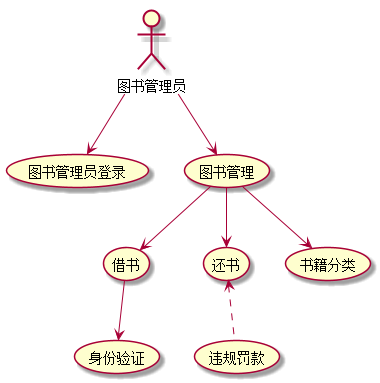
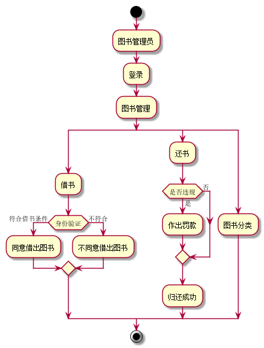

# 实验2：图书管理系统用例建模
## 1.图书管理用例
### 1.1图书管理用例PlantUML源码如下：
```
@startuml
   :图书管理员: --> (图书管理员登录)
   :图书管理员: --> (图书管理)
   :图书管理:-->(借书)
   :图书管理:-->(还书)
   :图书管理:-->(书籍分类)
   :借书:-->(身份验证)
   :还书:<..(违规罚款)
@enduml
```
### 1.2图书管理用例图如下：




**“图书管理”用例流程图源码如下：**
``` 
@startuml
start
:图书管理员;
:登录;
:图书管理;
split
:借书;
if (身份验证) then (符合借书条件)
:同意借出图书;
else (不符合)
:不同意借出图书;
endif
split again
:还书;
if (是否违规) then (是)
:作出罚款;
else(否)
endif
:归还成功;
split again
:图书分类;
end split
stop
@enduml
```

**“图书管理”用例流程图如下：**



## 2.用例分析

### 借阅用例

|用例名称|图书管理员借阅用例|
|:------|:---------|
|参与者|图书管理员|
|前置条件 |图书管理员已被识别和授权|
|后置条件 |更新图书信息|
|主事件流|1.系统发给图书管理员归还违规，以及借阅身份不符合申请<br> 2.图书管理员处理信息，并将处理的信息返回给系统；<br> 3.系统记录并修改信息|

### 图书分类用例
|用例名称|图书分类|
|:------|:---------|
|参与者|图书管理员|
|前置条件 |图书管理员已被识别和授权|
|后置条件 |更新图书信息|
|主事件流|1.系统发给图书管理员新录入图书信息<br> 2.图书管理员进行分类，并将处理的信息返回给系统；<br> 3.系统记录并修改信息|
