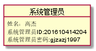

# 实验3：图书管理系统领域对象建模
|学号|班级|姓名|
|:-------:|:-------------: | :----------:|
|201610414204|软件(本)16-2|高杰|

## 1. 图书管理系统的类图

### 1.1 类图PlantUML源码如下：

``` class
@startuml


class 读者 {
-性别：string
-读者姓名：string
-读者ID:string
-读者密码:string
--
+Borrower()
+Return()
+SearchInformation()
+Renew()
+SearchBookInformation()
}
class 系统管理员{
-系统管理员姓名：string
-系统管理员ID：string
-系统管理员密码：string
--
+AddBook()
+DeleteBook()
+AddReader()
+DeleteReader()
+UpdateReader()
+SystemMaintenance()
}
class 图书管理员{
-姓名：string
-ID：string
-密码：string
--
+BorrowTreat()
+ReturnTreat()
+BookClassification()

}

class 图书借出类{
-借阅者ID：string
-图书ID：string
-借阅编号：string
-借阅时间：data time
-归还时间：data time
--
+RenewBorrowInformatica()
+RenewBookInformation()
}
class 图书类{
-图书ID：string
-图书名字：string
-作者：String
-出版社：String
--
+Add()
+Delete()
+Search()
}
系统管理员 "1"-"n" 读者
读者 "n"-"1..n" 图书管理员
(读者,图书管理员).图书类
图书借出类 "0..n"--"n" 读者
图书类 "0..1"--"1..n" 图书借出类


@enduml
```

### 1.2. 类图如下：


### 1.3. 类图说明：
|类|功能|
|:-------:|:-------:|
|系统管理员类|添加图书、删除图书、添加读者、修改读者、删除读者、系统维护功能|
|图书管理员类|借阅处理、归还处理、图书分类|
|读者类|查询信息、查询图书信息、借阅、归还、更新|
|图书类|图书添加、图书删除、图书搜索|
|图书借出类|更新图书信息、更新图书借阅信息|

## 2. 图书管理系统的对象图
### 2.1 读者类的对象图
#### 源码如下：
``` class
@startuml
class 读者 {
性别:男
姓名：高杰
读者ID:201610414204
读者密码:gjzazj1997
}
@enduml
``` 
#### 对象图如下：


### 2.2 系统管理员类的对象图
#### 源码如下：
``` class
@startuml
class 系统管理员 {
姓名：高杰
系统管理员ID:201610414204
系统管理员密码:gjzazj1997
}
@enduml
``` 
#### 对象图如下：

### 2.3 图书管理员类的对象图
#### 源码如下
```class
@startuml
class 图书管理员 {
姓名：高杰
图书管理员ID:201610414204
图书管理员密码:gjzazj1997
}
@enduml
```

#### 对象图如下：


