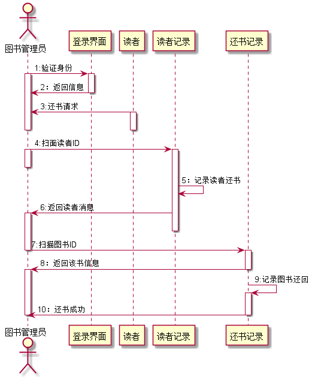

# 实验4：图书管理系统顺序图绘制
|学号|班级|姓名|
|:-------:|:-------------: | :----------:|
|201610414204|软件(本)16-2|高杰|

## 图书管理系统的顺序图

## 1. 借书用例
## 1.1. 借书用例PlantUML源码

``` sequence
@startuml
actor 图书管理员
图书管理员 -> 登录界面:1：验证身份
activate 图书管理员
activate 登录界面
登录界面 -> 图书管理员:2：返回信息
deactivate 登录界面
读者 ->图书管理员:3:发出借书请求
activate 读者
deactivate 读者
deactivate 图书管理员
图书管理员 -> 读者记录:4：扫描读者ID
activate 图书管理员
deactivate 图书管理员
activate 读者记录
读者记录 ->读者记录:5：记录读者借书
读者记录 ->图书管理员:6：返回读者信息
deactivate 读者记录
activate 图书管理员
图书管理员->借书记录:7：扫描图书ID
activate 借书记录
deactivate 图书管理员
借书记录 ->图书管理员:8：返回该书信息
deactivate 借书记录
activate 图书管理员
deactivate 图书管理员
借书记录 ->借书记录:9：记录图书借出
activate 借书记录
deactivate 图书管理员
借书记录->图书管理员:10：借阅成功
deactivate 借书记录
activate 图书管理员
deactivate 借书记录
图书管理员 ->读者:11：将书给读者
activate 读者
deactivate 读者
deactivate 图书管理员
@enduml
```

## 1.2. 借书用例顺序图


## 1.3. 借书用例顺序图说明
|步骤|操作|
|:-------:|:--------:|
|1|图书管理员登录验证身份|
|2|登录界面返回信息|
|3|读者向图书管理员发出借书请求|
|4|图书管理员扫描发送请求的读者ID|
|5|查询读者借书记录|
|6|返回读者信息给图书管理员|
|7|图书管理员扫面该书的ID|
|8|返回该书信息给图书管理员|
|9|记录图书借出|
|10|系统将借阅成功信息返还给图书管理员|
|11|图书管理员将书给读者|
***

## 2. 还书用例
## 2.1. 还书用例PlantUML源码

``` sequence
@startuml
actor 图书管理员
图书管理员 ->登录界面:1:验证身份
activate 图书管理员
activate 登录界面
登录界面->图书管理员:2：返回信息
deactivate 登录界面
图书管理员 <-读者:3:还书请求
activate 读者
deactivate 读者
deactivate 图书管理员
图书管理员 ->读者记录:4:扫面读者ID
activate 图书管理员
deactivate 图书管理员
activate 读者记录
读者记录 ->读者记录:5：记录读者还书
读者记录 ->图书管理员:6:返回读者消息
activate 图书管理员
deactivate 读者记录
图书管理员 ->还书记录:7:扫描图书ID
deactivate 图书管理员
activate 还书记录
还书记录 ->图书管理员:8：返回该书信息
deactivate 还书记录
还书记录 ->还书记录:9:记录图书还回
activate 还书记录
还书记录 ->图书管理员:10：还书成功
deactivate 还书记录
deactivate 图书管理员
@enduml
```

## 2.2. 还书用例顺序图


## 2.3. 还书用例顺序图说明
|步骤|操作|
|:-------:|:--------:|
|1|图书管理员登录验证身份|
|2|登录界面返回信息|
|3|读者向图书管理员发出还书请求|
|4|图书管理员扫描发送请求的读者ID|
|5|查询读者还书记录|
|6|返回读者信息给图书管理员|
|7|图书管理员扫面该书的ID|
|8|返回该书信息给图书管理员|
|9|记录图书还回|
|10|系统将还书成功信息返还给图书管理员|
***
## 3. 删除读者用例
## 3.1. 删除读者用例PlantUML源码

``` sequence
@startuml
actor 系统管理员
系统管理员 ->登录界面:1:验证身份
activate 系统管理员
activate 登录界面
登录界面 ->系统管理员:2:返回验证
deactivate 登录界面
系统管理员 ->查找读者界面:3:查找读者信息
deactivate 系统管理员
activate 查找读者界面
查找读者界面->读者记录:4:查找信息
activate 读者记录
读者记录 ->读者记录:5:检查读者信息
deactivate 查找读者界面
读者记录->系统管理员:6：返回读者信息
activate 系统管理员
deactivate 系统管理员
deactivate 读者记录
系统管理员->查找读者界面:7：删除读者信息
activate 系统管理员
activate 查找读者界面
查找读者界面 ->系统管理员:8:返回删除成功
deactivate 查找读者界面
deactivate 系统管理员

@enduml
```

## 3.2. 删除读者用例顺序图


## 3.3. 删除读者用例顺序图说明
|步骤|操作|
|:-------:|:--------:|
|1|系统管理员登录验证身份|
|2|返回验证|
|3|查找读者阶界面读者信息|
|4|查找信息|
|5|检查读者信息|
|6|返回读者信息给系统管理员|
|7|系统管理员删除读者信息|
|8|返回删除读者信息成功|
***
## 4. 添加读者用例
## 4.1. 添加读者用例PlantUML源码

``` sequence
@startuml
actor 系统管理员
系统管理员 -> 登录界面:1:验证身份（）
activate 系统管理员
activate 登录界面
登录界面 ->系统管理员:2：返回验证信息
deactivate 登录界面
系统管理员 ->读者记录:3:像数据库添加读者账号（）
deactivate 系统管理员
activate 读者记录
读者记录 -> 读者记录 :4：检查账户
读者记录 -> 系统管理员 :5： 返回添加读者信息
deactivate 读者记录
activate 系统管理员
系统管理员 -> 读者:6：将新开设的账户给读者
activate 读者
deactivate 读者
deactivate 系统管理员
@enduml
```

## 4.2. 添加读者用例顺序图


## 4.3. 添加读者用例顺序图说明
|步骤|操作|
|:-------:|:--------:|
|1|系统管理员登录验证身份|
|2|返回验证|
|3|向数据库添加读者账号|
|4|检查账号（是否满足添加要求）|
|5|返回添加读者信息|
|6|将新开设的账号给读者|

***
## 5. 管理图书分类用例
## 5.1. 管理图书分类用例PlantUML源码

``` sequence
@startuml
actor 图书管理员
activate 图书管理员
图书管理员 -> 登录界面:1：登录
activate 登录界面
deactivate 图书管理员
登录界面 -> 效验信息:2：查找
activate 效验信息
效验信息->效验信息:3：效验信息
deactivate 登录界面
登录界面->图书类别管理界面:进入
deactivate 效验信息
activate 登录界面
activate 图书类别管理界面
deactivate 登录界面
图书类别管理界面 ->数据库:查询条件
activate 数据库
deactivate 登录界面
数据库 ->图书类别管理界面:返回查询
deactivate 数据库
图书类别管理界面 ->图书类别管理界面:修改信息
图书类别管理界面 ->数据库:保存
activate 数据库
deactivate 图书类别管理界面
deactivate 数据库
@enduml
```

## 5.2.管理图书分类用例顺序图


## 5.3. 管理图书分类用例顺序图说明
|步骤|操作|
|:-------:|:--------:|
|1|图书管理员登录到登录界面|
|2|查找|
|3|效验信息|
|4|然后进入图书类别管理界面|
|5|以一定查询条件查询数据库储存图书数据|
|6|返回查询结果|
|7|修改分类信息|
|8|将修改结果保存到数据库|
***

