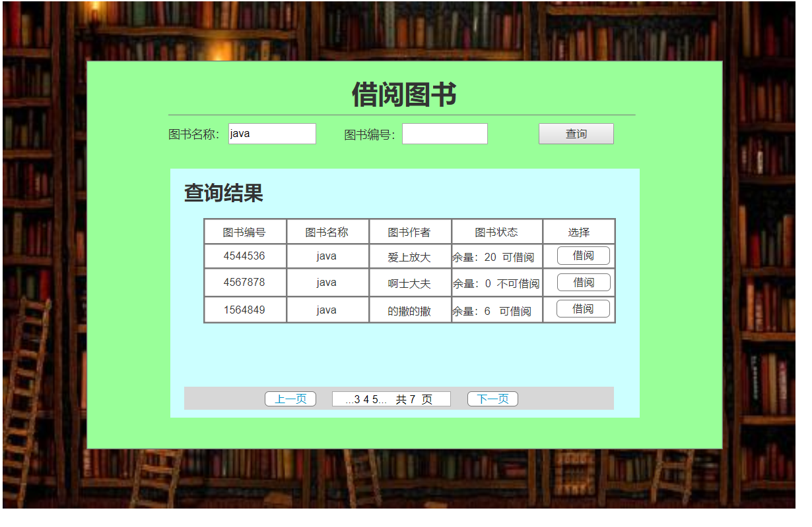

# 实验5：图书管理系统数据库设计与界面设计
|学号|班级|姓名|
|:-------:|:-------------: | :----------:|
|201610414204|软件(本)16-2|高杰|

## 1.数据库表设计

## 1.1. 系统管理员
|字段|类型|主键，外键|可以为空|默认值|约束|说明|
|:-------:|:-------------:|:------:|:----:|:---:|:----:|:-----|
|adminID|string|主键|否|null |主键约束|唯一表明系统管理员账号|
|adminName|string|外键|否|null|not null|系统管理员姓名|
|adminPassword|string|外键|否|null|not null|系统管理员账号密码|

## 1.2. 读者
|字段|类型|主键，外键|可以为空|默认值|约束|说明|
|:-------:|:-------------:|:------:|:----:|:---:|:----:|:-----|
|readerID|string|主键|否|null|主键约束|唯一表面读者账号|
|readerName|string|外键|否|null | not null|读者姓名|
|readerSex|string|外键|否| 男| |读者性别|
|readerPassword|string|外键|否|null| not null|读者账号密码|

## 1.3. 图书管理员
|字段|类型|主键，外键|可以为空|默认值|约束|说明|
|:-------:|:-------------:|:------:|:----:|:---:|:----:|:-----|
|liberanID|string|主键|否|null|主键约束|唯一表明图书管理员的账号|
|liberianName|string|外键|否|null|not null|图书管理员姓名|
|liberianPassword|string|外键|否|null|not null|图书管理员账号密码|

## 1.4. 图书类
|字段|类型|主键，外键|可以为空|默认值|约束|说明|
|:-------:|:-------------:|:------:|:----:|:---:|:----:|:-----|
|bookID|string|主键|否|null|主键约束|唯一标示图书的编号|
|bookName|string| 外键|否|null|not null|图书名称|
|author|string|外键|是|null| |作者|
|num|int|外键|是|0| |图书剩余数量|
|publishing|string|外键|是|null| |出版社|

## 1.5. 图书借出类
|字段|类型|主键，外键|可以为空|默认值|约束|说明|
|:-------:|:-------------:|:------:|:----:|:---:|:----:|:-----|
|borrowNum|string|主键|否|null|主键约束|唯一标识图书借出借阅编号|
|bookID|string|外键|否|null|not null|图书编号|
|borrowerID|string|外键|否|null|mot null|借阅者账号|
|borrowTime|date time|外键|否| | |借阅时间|
|returnTime|date time|外键|否| | |归还时间|

***

## 2. 界面设计
## 2.1. 借书界面设计

[网页地址](https://gaojie19971011.github.io/is_analysis_pages/)
- 用例图参见：借书用例
- 类图参见：借书类，读者类
- 顺序图参见：借书顺序图
- API接口如下：

1. 图书查询
- 功能：根据图书名称查询
- 请求地址： http://borrowbook/v1/api/select
- 请求方法：POST
- 请求参数：

|参数名称|必填|说明|
|:-------:|:-------------: | :----------:|
|bookName|否|搜索图书的条件|
|bookID|否|搜索图书的条件|
|access_token|是|用于验证请求合法性的认证信息。 |
|method|是|固定为 “GET”。|

- 返回实例：
```
{
    "info": "查询结果",
    "data": data: [
                {bookName: java,bookID:"4544536" "author": "爱上放大", "bookStu":"1"  "num":"20"},
                {bookName: java,bookID:"4567878" "author": "啊士大夫", "bookStu":"0"  "num":"0"},
                ...
            ],
    "code": 200
}
```
- 返回参数说明：
    
|参数名称|说明|
|:-------:|:-------------: |
|Info|返回信息|
|data|返回查询图书信息列表|
|code|返回码|

2. 借阅图书

- 功能：借阅图书
- 请求地址： http://borrow/v1/api/borrowbook
- 请求方法：POST
- 请求参数：

|参数名称|必填|说明|
|:-------:|:-------------: | :----------:|
|bookID|是|用于借阅图书的唯一标识|
|access_token|是|用于验证请求合法性的认证信息。 |
|method|是|固定为 “GET”。|

- 返回实例：
```
{
    "info": "借阅成功",
    "data": {
        bookName: java,
        "author": "爱上放大", 
        "publishing":"长城"
            },
    "code": 200
}
```
- 返回参数说明：
    
|参数名称|说明|
|:-------:|:-------------: |
|Info|返回信息|
|data|图书基本信息|
|dodo|返回码|

 